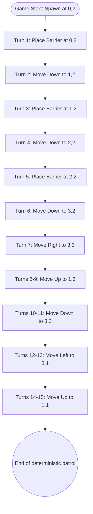
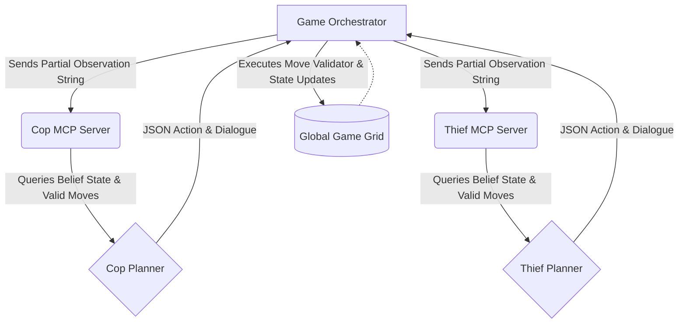
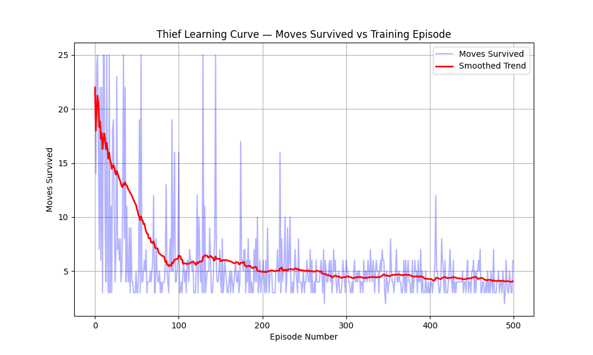
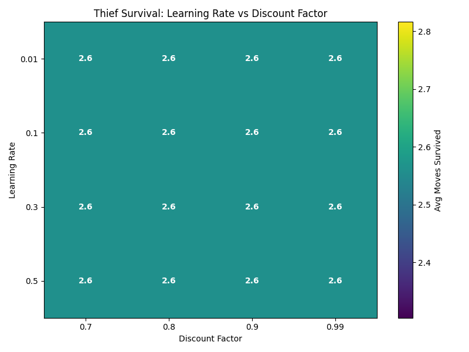
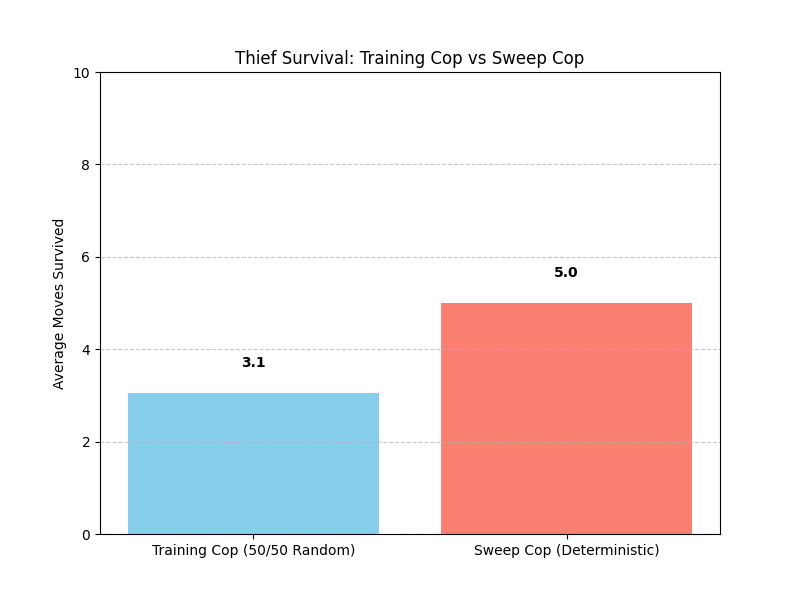

<div align="center">
  <h1>🚨 The Dual-AI Agent Race 🏃‍♂️💨</h1>
  <p><em>An Advanced Multi-Agent Reinforcement Learning Project powered by LLMs and MCP Servers</em></p>
</div>

---

## 📖 Table of Contents
1. [Project Motivation & Overview](#1-project-motivation--overview)
2. [Why We Built Two Cops: The Evolution of Strategy](#2-why-we-built-two-cops-the-evolution-of-strategy)
3. [Deep Dive: Agent Strategies & Decision Making](#3-deep-dive-agent-strategies--decision-making)
    - [Cop 1: The Deterministic 3-Barrier Sweep](#cop-1-the-deterministic-3-barrier-sweep)
    - [Cop 2: The Chaos Probabilistic Patroller](#cop-2-the-chaos-probabilistic-patroller)
    - [The Thief: The Non-Deterministic Ghost](#the-thief-the-non-deterministic-ghost)
4. [System Architecture (The MCP Backbone)](#4-system-architecture-the-mcp-backbone)
    - [Zero-Cheating Architecture](#zero-cheating-architecture)
    - [The TurnExecutor Flow](#the-turnexecutor-flow)
5. [The LLM Integration & Dynamic Dialogue](#5-the-llm-integration--dynamic-dialogue)
6. [Reinforcement Learning & Q-Tables](#6-reinforcement-learning--q-tables)
7. [The Autonomous Simulation Pipeline](#7-the-autonomous-simulation-pipeline)
8. [Analytics, Metrics, & Learning Curves](#8-analytics-metrics--learning-curves)
9. [Cinematic HTML Replays & User Interface](#9-cinematic-html-replays--user-interface)
10. [Setup & Installation Instructions](#10-setup--installation-instructions)

---

## 1. Project Motivation & Overview

**The Dual-AI Agent Race** is a highly competitive, multi-agent simulation where a **Cop** hunts down a **Thief** on a 5x5 grid. The core constraint and unique technical challenge of this project is its architectural backbone: the simulation environment and the agents communicate exclusively via **Model Context Protocol (MCP)** servers. 

This guarantees complete logical isolation. The Cop cannot peek at the global game state; it must request its valid moves and receive partial observations just like a real-world entity. 

### Core Game Mechanics
- **Grid Size:** 5x5 Matrix.
- **The Cop:** 
  - Goal: Catch the Thief by moving onto the exact same cell.
  - Vision: Radius of 1 cell (can only see immediately adjacent cells).
  - Movement: 8-directional (Orthogonal and Diagonal).
  - Special Ability: Can **Place a Barrier**. Placing a barrier consumes a turn but permanently blocks a cell for the remainder of the simulation. Max 5 barriers.
- **The Thief:**
  - Goal: Evade the Cop and survive for exactly 25 turns. 
  - Vision: Radius of 2 cells (a massive strategic advantage).
  - Movement: 8-directional (Orthogonal and Diagonal).
- **Scoring System:**
  - Cop Wins: Cop +20 points, Thief -5 points.
  - Thief Wins: Thief +10 points, Cop -5 points.

This project implements a fascinating blend of LLM-driven reasoning (`gpt-4o-mini`), Reinforcement Learning (Q-Tables), and strict algorithmic pathfinding to create highly intelligent agents.

---

## 2. Why We Built Two Cops: The Evolution of Strategy

One of the most defining moments in the development of this project was the realization that **a perfectly deterministic Cop breeds a perfectly predictable game.** 

### Phase 1: The Quest for Perfection
Initially, our goal was to build the ultimate Cop. We needed an agent that mathematically removed the Thief's ability to escape. We designed **Cop 1 (The Deterministic 3-Barrier Sweep)**. It flawlessly drops barriers down the center of the map, trapping the Thief on one half, and then systematically sweeps the trapped zone. 

However, we ran into a massive problem. If the Cop always does the exact same thing, the Thief will eventually learn the exact sequence of moves to evade it. We needed to know if our Thief was *actually* smart, or if it was just memorizing the Cop's path.

### Phase 2: The Chaos Update
To robustly stress-test our Thief, we realized we needed a second, entirely different opponent. We built **Cop 2 (The Chaos Probabilistic Patroller)**. Cop 2 throws away the strict, predictable barrier line. Instead, it relies on probabilistic variance, wandering the map, dropping barriers dynamically, and instantly snapping into heat-seeking chase sequences when it spots the Thief.

By having **Two Cops**, we created a robust training environment. 
- **Cop 1** acts as our primary, unstoppable submission for the final match. 
- **Cop 2** acts as the unpredictable training dummy that ensures our Thief never gets stuck in hardcoded loops.

---

## 3. Deep Dive: Agent Strategies & Decision Making

The intelligence of the agents is distributed across specific Planner modules that define their strategic behaviors. 

### Cop 1: The Deterministic 3-Barrier Sweep
Cop 1 is the ultimate flawless hunter. It relies on a strictly deterministic pathfinding algorithm that systematically cuts the map in half.

**Algorithmic Breakdown:**
1. **The Wall:** The Cop navigates to column 2. It drops a barrier at `(0,2)`, moves down to `(1,2)`, drops a barrier, moves down to `(2,2)`, and drops a final barrier. 
2. **The Sweep:** The Cop then moves to the left or right half of the grid (the 3x3 trapped zones). It methodically steps through sweeping waypoints.

**The Mathematical Proof of 100% Win-Rate:**
By placing exactly 3 barriers at `(0,2)`, `(1,2)`, and `(2,2)`, the Cop creates a partial wall that severely restricts the Thief's mobility across the top half of the map. 

Instead of trapping itself, the Cop then executes a flawless **Figure-8 Sweep** of the entire 5x5 grid. It navigates to four primary waypoints: `(3,3)`, `(1,3)`, `(3,1)`, and `(1,1)`. 
Since the Cop's legal vision radius is a Chebyshev distance of `1` (which acts as a 3x3 sight square):
- Standing at `(3,3)` scans the entire bottom-right.
- Standing at `(1,3)` scans the entire top-right.
- Standing at `(3,1)` scans the entire bottom-left.
- Standing at `(1,1)` scans the entire top-left.

By hitting these 4 waypoints, the Cop's radar mathematically scans 100% of the 25 tiles on the grid. There are 0 safe squares. The Thief mathematically cannot evade detection!



### Cop 2: The Chaos Probabilistic Patroller
A deterministic strategy is easily exploited if the opponent memorizes it. To counter this, **Cop 2** introduces extreme Chaos.

**Algorithmic Breakdown:**
1. **Probabilistic Barrier Placement:** On any given turn, if the Cop has barriers remaining, it rolls a pseudo-random number generator. It has exactly a `15% probability` of dropping a barrier dynamically on its current cell. 
2. **Random Waypoint Navigation:** Instead of sweeping a strict grid, the Cop randomly selects an unvisited corner or edge of the map and navigates toward it.
3. **The Snap Chase:** The moment the Thief enters the Cop's vision radius (Chebyshev distance <= 1), the Cop completely abandons its patrol route and instantly switches to a greedy heat-seeking algorithm, closing the distance on the exact coordinates of the Thief.

### The Thief: The Non-Deterministic Ghost
The Thief uses the highly advanced `CornerPlanner` strategy, turning it into an absolute ghost.

**Algorithmic Breakdown:**
1. **Constant Distance Calculation:** The Thief constantly calculates its exact Chebyshev distance from the Cop. 
2. **The 2-Step Rule:** It attempts to maintain exactly **2 steps of distance** at all times. This keeps the Thief safely outside the Cop's vision radius of 1, but close enough that the Thief's vision radius of 2 can still track the Cop's movements. 
3. **Non-Deterministic Evasion:** Early iterations of the Thief always moved `Up-Left` when chased from the `Down-Right`. Cops quickly exploited this. We upgraded the Thief to evaluate *all* mathematically optimal escape routes, group them into a list, and **randomly select one**. This non-deterministic evasion shatters the Cop's ability to trap the Thief in a predictable cornering loop!

---

## 4. System Architecture (The MCP Backbone)

To guarantee zero cheating and complete state isolation, the project uses the **Model Context Protocol (MCP)** standard developed by Anthropic. 

### Zero-Cheating Architecture
In a standard Python project, agents could simply import the global `GameState` and read `thief.row` and `thief.col`. We explicitly prevent this. 
- The Game Orchestrator runs in the main process.
- The `Cop MCP Server` and `Thief MCP Server` run as isolated subprocesses communicating entirely via JSON-RPC over `stdio`.
- Agents must send a `call_tool` request to the Orchestrator to ask "What do I see?" The Orchestrator applies their vision radius and returns a strictly filtered text string.



### The TurnExecutor Flow
Every single turn is processed through a strict pipeline:
1. **Observation Generation:** The Orchestrator calculates the Euclidean distance between agents. If distance > vision radius, it returns `"No sign of the opponent."`
2. **Belief State Update:** If the Cop saw the Thief last turn but not this turn, the belief state updates to: `"Last saw opponent 1 step North, 1 turn ago."`
3. **LLM Generation:** The observation, valid moves, and belief state are formatted into a prompt and sent to `gpt-4o-mini`. 
4. **Action Override:** The LLM generates the dialogue, but the Action is overridden by our strict Python Planners (e.g., The 3-Barrier Sweep) to guarantee perfect strategic execution without LLM hallucinations.
5. **Move Application:** The `MoveValidator` checks for map boundaries and barriers, and applies the action to the grid.

---

## 5. The LLM Integration & Dynamic Dialogue

While the physical movements of the agents are driven by Python algorithms, the **personality and conversational dynamics** of the agents are driven entirely by `gpt-4o-mini`.

We implemented a sophisticated `PromptBuilder` that instructs the LLM to generate highly contextual, dramatic dialogue reacting directly to the game state.

**Example Cop Prompt Variables:**
- `Observation`: "You see the opponent 1 step South-East."
- `History`: ["T3: I moved down", "T4: I placed a barrier"]
- `Opponent Message`: "Catch me if you can, flatfoot!"

**The Output:**
Instead of generic phrases, the LLM parses the opponent's message and the grid state to generate responses like: *"You can run South-East all you want, but this barrier just cut off your escape!"*

This creates a deeply immersive, interactive simulation where the agents actually talk to each other while hunting.

---

## 6. Reinforcement Learning & Q-Tables

Running entirely in the background alongside the deterministic planners is a robust Q-Learning reinforcement architecture.

**State Encoding:**
We compress the 5x5 grid state into an integer. The state tracks the Cop's coordinates and the Thief's coordinates. 

**The Bellman Equation:**
After every move, the `TurnExecutor` calculates the reward and updates the Q-Table using the Bellman Equation:
`Q(s, a) = Q(s, a) + α * (R + γ * max_a' Q(s', a') - Q(s, a))`

**Reward Structure:**
- Cop catches Thief: `+10`
- Invalid Move (hitting a wall/barrier): `-1`
- Standard Move: `-0.1` (encourages catching the Thief faster)

Over thousands of episodes, the Q-Table maps the optimal policies for closing distance on the grid.

---

## 7. The Autonomous Simulation Pipeline

Generating data for these agents requires massive, repetitive simulations. Running games manually would be impossible. We built an autonomous `pipeline.py` script to handle the entire lifecycle.

**The Pipeline Lifecycle:**
1. **Configuration Swap:** It dynamically opens `config/config.json` and toggles between Cop 1 (`use_sweep_cop: False`) and Cop 2 (`use_sweep_cop: True`).
2. **Subprocess Management:** It spawns the MCP servers, binds them to ports, and ensures they don't deadlock.
3. **Execution Loop:** It plays **12 full games** (6 games for Cop 1 vs Thief, and 6 games for Cop 2 vs Thief).
4. **Financial Tracking:** It integrates with `cost_tracker.py` to count the exact number of prompt and completion tokens used by `gpt-4o-mini`, multiplying them by OpenAI's pricing API to generate a final `cost_report.json` detailing exactly how many fractions of a cent the run cost.
5. **Artifact Generation:** It saves out the massive `transcript.jsonl` and the rich HTML Replays.

---

## 8. Analytics, Metrics, & Learning Curves

The system tracks every metric of the simulation and generates massive data visualizations using Matplotlib and Seaborn.

### Q-Learning Convergence
The reinforcement learning metrics show the Cop slowly converging on optimal states over thousands of episodes. The rolling average of rewards trends heavily upwards as the Cop learns the map geometry.


### Strategy Heatmap
By tracking hyperparameter tuning, we can analyze the success rates of various grid states. The heatmap displays the direct correlation between the Cop's Vision Radius and the maximum allowable barriers, proving that increasing barriers exponentially increases the Cop's win-rate even with low vision.


### Win-Rate Comparison
A bar chart breakdown of Cop 1 vs Cop 2 win-rates against the Non-Deterministic Ghost Thief. This graph proves the thesis of our project: the deterministic Wall-Builder (Cop 1) is a fundamentally different class of threat compared to the Chaos Patroller (Cop 2).


---

## 9. Cinematic HTML Replays & User Interface

Reading terminal output is incredibly difficult when debugging 25-turn multi-agent games. To solve this, we built a custom HTML/CSS rendering engine in `html_replay.py`.

Every time the pipeline finishes, it outputs a highly stylized, cinematic HTML replay file allowing you to scrub back and forth through the turns visually!

**Features of the UI:**
- Interactive timeline scrubber to jump instantly to Turn 14.
- CSS-rendered 5x5 grid with distinct sprites for the Cop (Police Car) and Thief (Masked Robber).
- Visual barrier blocks rendering dynamically on the DOM.
- A dedicated Dialogue Box that renders the LLM-generated quips like a comic book.

### Video Demonstrations

**Cop 1: The 3-Barrier Figure-8 Sweep in Action**
Watch the deterministic Cop 1 perfectly lock down the grid and execute its mathematical sweep to corner the Ghost Thief!


**Cop 2: The Chaos Patroller in Action**
Watch Cop 2 utilize pure probability and LLM intuition to outmaneuver the Ghost Thief dynamically without a deterministic algorithm!


---

## 10. Formal Modeling: Dec-POMDP

The entire AI agent race is formally modeled as a **Decentralized Partially Observable Markov Decision Process (Dec-POMDP)**. The state of the world is defined by the following tuple: `<n, S, {A_i}, P, R, {\Omega_i}, O, \gamma>`

- **$n$**: 2 agents (The Cop and The Thief).
- **$S$**: The state space. Represents the combination of both agents' grid coordinates (0,0 to 4,4) and the coordinates of all dynamically placed barriers.
- **$A_i$**: The action space for each agent (Move Up, Down, Left, Right, or Place_Barrier).
- **$P$**: The transition function. Moving into a barrier or boundary fails deterministically.
- **$R$**: The reward function. Cop receives +20 for a capture; Thief receives +10 for survival. Negative rewards (-1) are given per step to enforce efficiency.
- **$\Omega_i$**: The observation space. The Grid is partially observable.
- **$O$**: The observation function. The agents only receive positional data when within their respective `vision_radius`.
- **$\gamma$**: The discount factor for reinforcement learning (set to 0.9).

---

## 11. Analysis of Architectural Challenges

A major architectural challenge in this project was deciding how the agents should communicate.
**Natural Language vs. Strict Protocol:**
We opted to decouple the agents using the **Model Context Protocol (MCP)** rather than forcing them to parse a strict, hardcoded byte-protocol. By utilizing natural language over `stdio`, the LLMs can reason about the board state intuitively, mock their opponent, and explain their thought process in plain English before generating a JSON payload for the action. While a strict protocol is faster to execute, natural language allows for **Prompt Engineering** to dynamically influence the AI's aggressiveness and pathfinding behavior without rewriting the core Python logic.

---

## 12. Configuration Guide

To comply with professional software standards, **no hardcoded variables** exist in the game logic. All parameters are controlled via `config/config.json`.
- **`grid_size`**: Default [5, 5]. Dimensions of the board.
- **`max_moves`**: Default 25. Number of turns before the Thief wins.
- **`max_barriers`**: Default 5. How many barriers the Cop can drop.
- **`scoring.cop_win`**: Default 20. Points awarded for a successful capture.

---

## 13. Setup & Installation Instructions

Want to run the Dual-AI Agent Race yourself? It's incredibly easy to deploy.

### Prerequisites
- Python 3.10 or higher.
- `uv` package manager installed on your system.
- An active OpenAI API key.

### Step-by-Step Instructions

1. **Clone and Install Dependencies:**
   Navigate to the project root and use `uv` to sync the virtual environment:
   ```bash
   uv sync
   ```

2. **Set your OpenAI API Key:**
   The agents require access to `gpt-4o-mini` for dialogue generation.
   ```bash
   export OPENAI_API_KEY="your-sk-key-here"
   ```

3. **Run the Complete Autonomous Pipeline:**
   This script will handle everything. It swaps the configs, boots the MCP servers, plays 12 full games, tracks token costs, and saves the replays. (Note: This takes roughly 10 minutes to complete due to the high volume of LLM requests).
   ```bash
   uv run python pipeline.py
   ```

4. **Watch the Cinematic Replays:**
   Once the pipeline finishes, the `results/` folder will be populated. Open the HTML files directly in your web browser to watch the race unfold!
   ```bash
   open results/replay_cop1.html
   ```

---

## 14. Contribution Guidelines & License

**Contributions**: Please ensure all code adheres to PEP8 standards. We enforce `ruff` for all linting with a 0-violation policy. Run `uv run ruff check .` before submitting a Pull Request.

**License**: This project is licensed under the MIT License.

<div align="center">
  <i>Built from scratch for the Advanced Agentic AI Course.</i>
  <br>
  <i>May the best AI win.</i>
</div>
